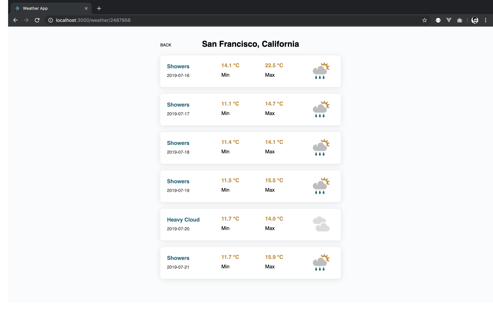
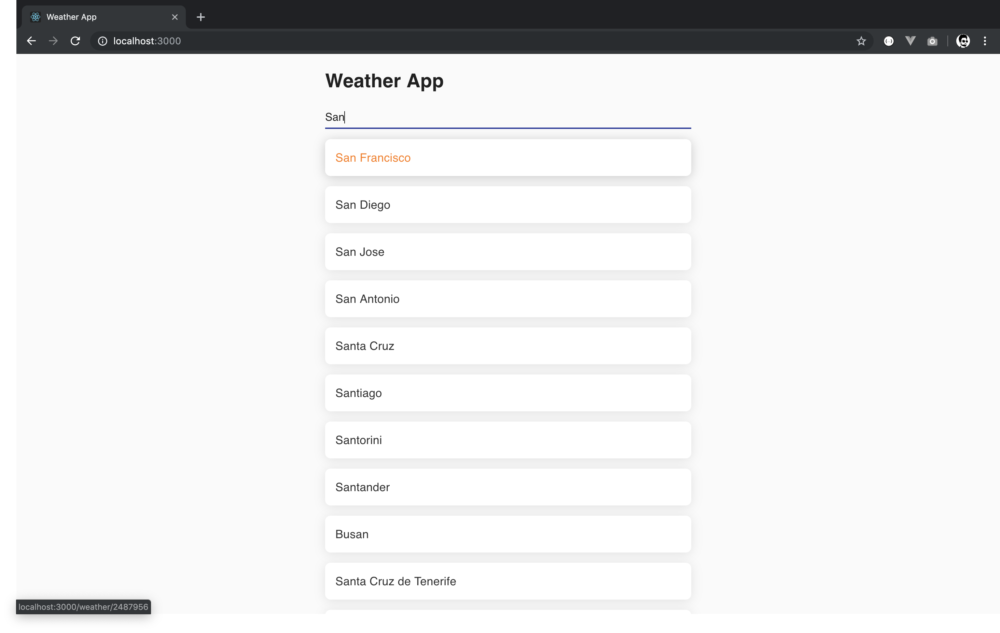

# Weather App
> Simple single page weather application



## Project setup
```
npm install
```

### Compiles and hot-reloads for development
```
npm run start
```

## User Guide

#### Search for a city of your choice


#### Click on the city to get the weather report


### Compiles and minifies for production
```
npm run build
```

### Run your tests
```
npm run test
```

### Lints and fixes files
```
npm run lint
```
